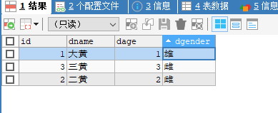
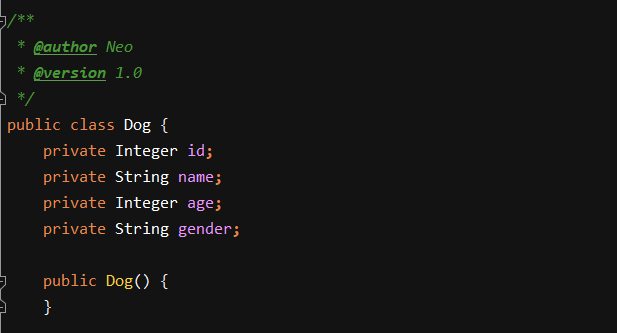
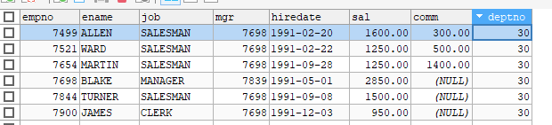

##  Mybatis

mybatis官方参考文档 :

https://mybatis.org/mybatis-3/zh/index.html

### ResultType

```xml
<!--    ResultType 表示返回结果的类型，此类型只能返回单一的对象
        当返回的结果是一个集合时，并不需要ResultMap，只需要ResultType指定集合中的元素类即可
 -->
<select id="selectAll" resultType="com.onisun.demo2.bean.Emp">
    select * from emp
</select>
```

```java
List<Emp> selectAll();
```

```java
@Test
public void test6() {
    //resultType 查询所有emp
    SqlSession sqlSession = sqlSessionFactory.openSession();
    EmpDao mapper = sqlSession.getMapper(EmpDao.class);

    List<Emp> list = mapper.selectAll();
    for (Emp emp : list) {
        System.out.println(emp);
    }

    sqlSession.commit();
    sqlSession.close();
}
```


### #{}和${}的区别

```xml
<!--    使用的#{} SQL是： select * from emp where empno = ?   预处理没有SQL注入问题
    使用${} SQL是：select * from emp where empno = 7369    拼接的，有SQL注入问题
    ${}有自己的使用场景，比如：当需要动态传入表名列名的时候
    select * from ${arg0} where empno = ${arg1}
    -->
    <select id="getEmpByEmpno" resultType="com.onisun.demo2.bean.Emp" >
        select * from emp where empno = #{empno}
    </select>
```


```xml
<!-- 如果参数不是一个对象，而是多个基本数据类型或者引用数据类型，#{属性名/参数名}无法取到值
，只能通过#{arg0,arg1...}  #{param0,param1...}
如果想要能够通过参数名获取到值，可以在接口参数中定义@Param("value")
-->
<select id="selectEmpByEmpnoAndSal2" resultType="com.onisun.demo2.bean.Emp" >
    select * from emp where empno = #{empno} and sal > #{sal}
</select>

<select id="selectEmpByEmpnoAndSal" resultType="com.onisun.demo2.bean.Emp" >
    select * from emp where empno = #{empno} and sal > #{sal}
</select>
```

```java
List<Emp>  selectEmpByEmpnoAndSal2(@Param("empno") Integer empno,@Param("sal") Double sal);
```


### 自定义Map结构

```xml
<!--    自定义map结构-->
    <select id="selectEmpByEmpnoAndSal3" resultType="com.onisun.demo2.bean.Emp" >
        select * from emp where empno = #{empno} and sal > #{sal}
    </select>
```

```java
List<Emp>  selectEmpByEmpnoAndSal3(Map<String,Object> map);
```

```java
@Test
public void test9() {
    //自定义map结构
    SqlSession sqlSession = sqlSessionFactory.openSession();
    EmpDao mapper = sqlSession.getMapper(EmpDao.class);
    Map<String, Object> map = new HashMap<String, Object>();
    map.put("empno", 7369);
    map.put("sal", 500.0);
    List<Emp> list = mapper.selectEmpByEmpnoAndSal3(map);
    for (Emp emp : list) {
        System.out.println(emp);
    }
    sqlSession.commit();
    sqlSession.close();
}
```


### 返回类型是Map类型

返回map集合，只有一个对象

```xml
<!--   返回map集合，只有一个对象会把查询结构的字段值作为key，结果作为value -->
    <select id="getEmpByEmpnoResultMap" resultType="map" >
        select * from emp where empno = #{empno}
    </select>
```

```java
Map<Object,Object> getEmpByEmpnoResultMap(Integer empno);
```

```java
@Test
public void test10() {
    //返回类型是map结构 只有1个结果
    SqlSession sqlSession = sqlSessionFactory.openSession();
    EmpDao mapper = sqlSession.getMapper(EmpDao.class);

    Map<Object, Object> map = mapper.getEmpByEmpnoResultMap(7369);
    System.out.println(map);

    sqlSession.commit();
    sqlSession.close();
}
```


返回的map集合包含多个对象

```xml
<!--    返回的map集合包含多个对象，此时没有key会报错。
        需要在Dao的方法上添加注解@Mapkey 来标识哪个属性值作为key -->
    <select id="selectAll2" resultType="map" >
        select * from emp
    </select>
```


```java
@MapKey("empno")
Map<String,Emp> selectAll2();
```


```java
@Test
public void test11() {
    //返回类型是map集合，包含多个结果
    SqlSession sqlSession = sqlSessionFactory.openSession();
    EmpDao mapper = sqlSession.getMapper(EmpDao.class);

    Map<String, Emp> stringEmpMap = mapper.selectAll2();
    System.out.println(stringEmpMap);

    sqlSession.commit();
    sqlSession.close();
}
```


### 自定义结果集


当表中的列名与类中的属性名不一致时，查询出来的结果，在赋值的时候会为空，比如：


dog表



dog类




sql

```xml
<select id="selectDogById" resultType="com.onisun.demo2.bean.Dog">
    select * from dog where id = #{id}
</select>
```


```java
@Test
public void test12() {
    SqlSession sqlSession = sqlSessionFactory.openSession();
    DogDao mapper = sqlSession.getMapper(DogDao.class);

    Dog dog = mapper.selectDogById(2);
    System.out.println(dog);

    sqlSession.commit();
    sqlSession.close();
}
```

打印结果：

```
DEBUG [main] - ==>  Preparing: select * from dog where id = ?
DEBUG [main] - ==> Parameters: 2(Integer)
TRACE [main] - <==    Columns: id, dname, dage, dgender
TRACE [main] - <==        Row: 2, 二黄, 2, 雌
DEBUG [main] - <==      Total: 1
Dog{id=2, name='null', age=null, gender='null'}
```

可以发现，能查询出来结果，但是赋值给Dog对象时却赋值不上。就是因为列名与属性名不一致，mybatis不知道如何赋值，此时就需要自定义结果集


#### 使用resultMap自定义结果集

```xml
<!--    使用resultMap自定义结果集-->
    <resultMap id="myDog" type="com.onisun.demo2.bean.Dog">
<!--        将属性名与表的列名一一映射-->
        <id property="id" column="id"/>
        <result property="name" column="dname"/>
        <result property="age" column="dage"/>
        <result property="gender" column="dgender"/>
    </resultMap>

<!--    属性名与列名不一致，mybatis可以查询成功，但无法给对象赋值  需要使用resultMap自定义结果集-->
    <select id="selectDogById" resultMap="myDog">
        select * from dog where id = #{id}
    </select>
    
```


```
DEBUG [main] - ==>  Preparing: select * from dog where id = ?
DEBUG [main] - ==> Parameters: 2(Integer)
TRACE [main] - <==    Columns: id, dname, dage, dgender
TRACE [main] - <==        Row: 2, 二黄, 2, 雌
DEBUG [main] - <==      Total: 1
Dog{id=2, name='二黄', age=2, gender='雌'}
```

此时发现对象已经成功赋值。


#### resultMap中的association


```xml
<!--   association :多表联合查询的时候使用，将结果集映射到javaType的类中 如:
表联合查询 将结果集映射到了Author类中，
  <association property="author" javaType="Author">
    <id property="id" column="author_id"/>
    <result property="username" column="author_username"/>
    <result property="password" column="author_password"/>
    <result property="email" column="author_email"/>
    <result property="bio" column="author_bio"/>
    <result property="favouriteSection" column="author_favourite_section"/>
  </association>

-->
```


案例：

Emp2实体类中关联了Dept类 ，根据关联的deptno进行联合查询

```java
public class Emp2 {
    private Integer empno;
    private String ename;
    private String job;
    private Integer mgr;
    private Date hiredate;
    private Double sal;
    private Double comm;
    private Dept dept;
```


Dept类：

```java
public class Dept {
    private Integer deptno;
    private String dname;
    private String loc;
```

表的字段：




xml:

```xml
<!--第一种方式：将实体类对象，写成对象.属性的方式-->
    <resultMap id="myEmp2" type="com.onisun.demo2.bean.Emp2">
        <result column="deptno" property="dept.deptno"/>
        <result column="loc" property="dept.loc"/>
        <result column="dname" property="dept.dname"/>
    </resultMap>
    <select id="selectEmpByEmpno" resultMap="myEmp2">
        select * from emp left join dept on emp.deptno = dept.deptno where empno = #{empno}
    </select>
```


推荐使用：

```xml
    <!--第2种方式：使用association-->
    <resultMap id="myEmp2" type="com.onisun.demo2.bean.Emp2">
        <id column="empno" property="empno"/>
        <result column="ename" property="ename"/>
        <result column="job" property="job"/>
        <result column="mgr" property="mgr"/>
        <result column="hiredate" property="hiredate"/>
        <result column="sal" property="sal"/>
        <result column="comm" property="comm"/>
<!--      property 表示类中的一个属性 ，javaType表示这个属性是什么类型  -->
        <association property="dept" javaType="com.onisun.demo2.bean.Dept">
            <id column="deptno" property="deptno"/>
            <result column="dname" property="dname"/>
            <result column="loc" property="loc"/>
        </association>
    </resultMap>
    <select id="selectEmpByEmpno" resultMap="myEmp2">
        select * from emp left join dept on emp.deptno = dept.deptno where empno = #{empno}
    </select>
```

第二种方式如果只写了association的话，其他的值会赋值不上


#### **resultMap中的collection**


查询对象中的属性是一个集合对象时使用，关联查询到该部门中所有的员工

```java
public class Dept {
    private Integer deptno;
    private String dname;
    private String loc;
    private List<Emp2> emps;
```


```xml
<resultMap id="myDept" type="com.onisun.demo2.bean.Dept">
    <id property="deptno" column="deptno"/>
    <result property="dname" column="dname"/>
    <result property="loc" column="loc"/>

    <collection property="emps" ofType="com.onisun.demo2.bean.Emp2">
        <id column="empno" property="empno"/>
        <result column="ename" property="ename"/>
        <result column="job" property="job"/>
        <result column="mgr" property="mgr"/>
        <result column="hiredate" property="hiredate"/>
        <result column="sal" property="sal"/>
        <result column="comm" property="comm"/>
    </collection>
</resultMap>
<select id="getDeptByDeptno" resultMap="myDept">
    select * from dept left join emp on dept.deptno = emp.deptno where dept.deptno = #{deptno}
</select>
```


```java
@Test
public void test14() {
    //表联合查询 Dept 包含List<emp>
    SqlSession sqlSession = sqlSessionFactory.openSession();
    DeptDao mapper = sqlSession.getMapper(DeptDao.class);

    Dept dept = mapper.getDeptByDeptno(10);
    System.out.println(dept);

    sqlSession.commit();
    sqlSession.close();
}
```


### 分步查询

Emp2Dao.xml

```xml
<!--    分步查询  两条查询语句，将另外一条查询语句的结果作为表，再使用查询语句进行二次查询 -->
    <select id="selectEmpByStep" resultMap="empStep">
        select * from emp where empno = #{empno}
    </select>

    <resultMap id="empStep" type="com.onisun.demo2.bean.Emp2">
        <id column="empno" property="empno"/>
        <result column="ename" property="ename"/>
        <result column="job" property="job"/>
        <result column="mgr" property="mgr"/>
        <result column="hiredate" property="hiredate"/>
        <result column="sal" property="sal"/>
        <result column="comm" property="comm"/>
<!--        这里select里面引用另外一条查询语句
            这里的column 指定哪个列相关联
      -->
        <association property="dept" select="com.onisun.demo2.dao.DeptDao.getDeptByStep" column="deptno"/>
    </resultMap>
```


DeptDao.xml

```xml
<!--    作为分步查询中的子查询-->
    <select id="getDeptByStep" resultType="com.onisun.demo2.bean.Dept">
        select * from dept where deptno = #{deptno}
    </select>
```


DeptDao.java

```java
Dept getDeptByStep(Integer deptno);
```

Emp2Dao.java

```java
Emp2 selectEmpByStep(Integer empno);
```

Test

```java
@Test
public void test15() {
    //分步查询
    SqlSession sqlSession = sqlSessionFactory.openSession();
    Emp2Dao mapper = sqlSession.getMapper(Emp2Dao.class);

    Emp2 emp2 = mapper.selectEmpByStep(7369);
    System.out.println(emp2);

    sqlSession.commit();
    sqlSession.close();
}
```


### 延迟加载

​	当我们在进行表关联的时候，有可能在查询结果的时候不需要关联对象的属性值，那么此时可以通过延迟加载来实现功能。在全局配置文件中添加如下属性

mysql-config.xml

```xml
<!--        开启延迟加载-->
        <setting name="lazyLoadingEnabled" value="true"/>
```


如果设置了全局加载，但是希望在某一个sql语句查询的时候不适用延时策略，可以添加如下属性：fetchType

```xml
<association property="dept" 
             select="com.mashibing.dao.DeptDao.getDeptAndEmpsBySimple" column="deptno"
             fetchType="eager"/>
```


### 动态sql

动态 SQL 是 MyBatis 的强大特性之一。如果你使用过 JDBC 或其它类似的框架，你应该能理解根据不同条件拼接 SQL 语句有多痛苦，例如拼接时要确保不能忘记添加必要的空格，还要注意去掉列表最后一个列名的逗号。利用动态 SQL，可以彻底摆脱这种痛苦。

-   if
-   choose (when, otherwise)
-   trim (where, set)
-   foreach

#### if

```xml
<!--    如果没有匹配条件，SQL语句会变成：select * from emp where
        如果两个条件都满足 SQL语句会变成： select * from emp where ename = ? sal > ?
        如果在sal前面加上and   SQL : select * from emp where and sal > ?
        这个查询也会失败。这个问题不能简单地用条件元素来解决。这个问题是如此的难以解决，
        以至于解决过的人不会再想碰到这种问题。
MyBatis 有一个简单且适合大多数场景的解决办法。而在其他场景中，可以对其进行自定义以符合需求。
而这，只需要一处简单的改动  使用<where>
    -->
    <select id="selectEmp" resultType="com.onisun.demo2.bean.Emp2">
        select * from emp where
        <if test="ename != null">
              ename = #{ename}
        </if>
        <if test="sal != null">
              sal > #{sal}
        </if>
    </select>
```


```xml
<!--    where 元素只会在子元素返回任何内容的情况下才插入 “WHERE” 子句。
而且，若子句的开头为 “AND” 或 “OR”，where 元素也会将它们去除。-->
    <select id="selectEmp2" resultType="com.onisun.demo2.bean.Emp2">
        select * from emp
        <where>
            <if test="ename != null">
                and ename = #{ename}
            </if>
            <if test="sal != null">
                and sal > #{sal}
            </if>
        </where>

    </select>
```

#### foreach

​	动态 SQL 的另一个常见使用场景是对集合进行遍历（尤其是在构建 IN 条件语句的时候）

```xml
<!--foreach是对集合进行遍历
    collection="deptnos"  指定要遍历的集合
    close="" 表示以什么结束
    index="" 给定一个索引值
    item=""  遍历的每一个元素的值
    open=""  表示以什么开始
    separator="" 表示多个元素的分隔符
    -->
    <select id="getEmpByDeptnos" resultType="Emp">
        select * from emp where deptno in 
        <foreach collection="deptnos" close=")" index="idx" item="deptno" open="(" separator=",">
            #{deptno}
        </foreach>
    </select>
```

